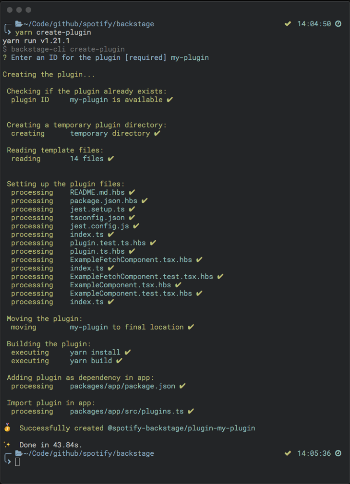
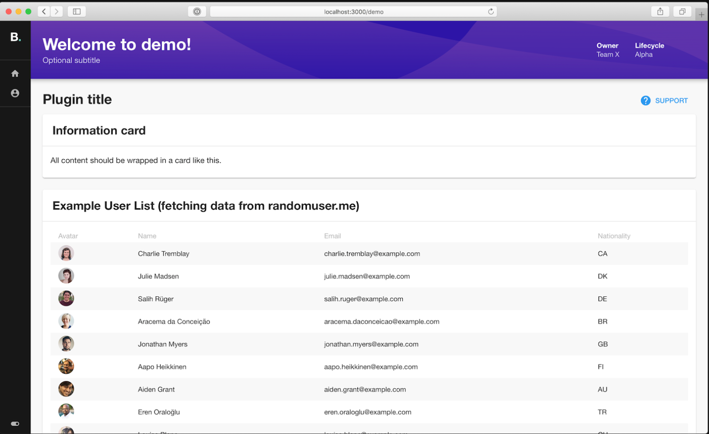

## Plugins

Documentation on how to create a plugin

## Intro to plugins

Backstage is a single-page application composed of a set of plugins which provide features. Each plugin is treated as a self-contained web app and can include almost any type of content.
Plugins looks like a mini project on its own with a package.json and src folder. Read more about a [Plugin Developement](https://backstage.io/docs/plugins/plugin-development) and [Structure of a Plugin](https://backstage.io/docs/plugins/structure-of-a-plugin).

## Create a Backstage Plugin
First, clone the backstage app repository. Create a new branch from master. For example feature/plugin-example. Make sure you have run **yarn install** and installed dependencies, then run the following on your command line (a shortcut to invoking the [backstage-clie create-plugin][https://backstage.io/docs/cli/commands#create-plugin]) from the root of your project.
```bash
yarn create-plugin
```


This will create a new Backstage plugin based on the ID that was provided. It will be built and added to the Backstage App automatically.

---
**NOTE**
If **yarn start** is already running you should be able to see the default page for your new plugin directly by navigating to **http://localhost:3000/my-plugin**.
---


You can also serve the plugin in isolation by running **yarn start** in the plugin directory. Or by using the yarn workspace command, for example:
```bash
yarn workspace @backstage/plugin-welcome start # Also supports --check
```
This method of serving the plugin provides quicker iteration speed and a faster startup and hot reloads. It is only meant for local development, and the setup for it can be found inside the plugin's dev/ directory.

